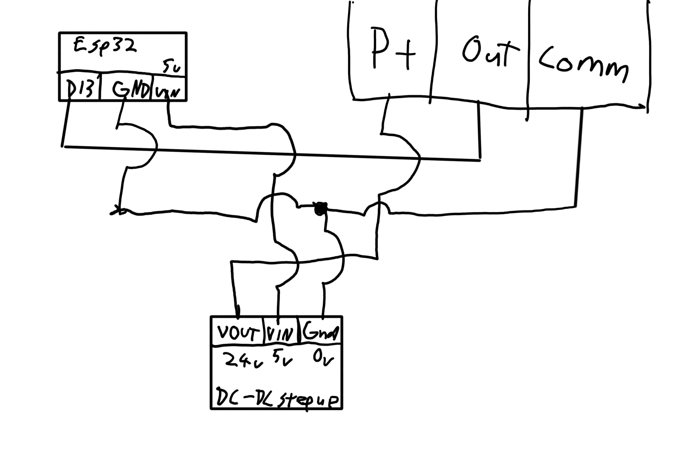

# JXK-7-DC-current-transmitter-for-arduino
Code is mostly written by AI, even README is written by AI. If youre new to programming, I suggest turnig to it for help. I used **esp 32** which has **D13** pin as analog input. Please note that same pin is **digital pin in arduino and doesnt work**. I recommend using **A0** in arduino.

This project uses current measuring device from aliexpress:
| 0-5V Output, 20mm Hole, DC24V,
DC0-100A DC Current Transducer Transmitter
https://a.aliexpress.com/_ExNHoUH

# True RMS Current Measurement

This Arduino project provides a straightforward and effective way to measure the true Root Mean Square (RMS) value of an analog signal, convert this RMS value into a current measurement based on specific calibration parameters, and finally adjust this measurement with a calibration offset. It's particularly useful for applications requiring accurate current monitoring and calibration against known standards.

## Features

- Measures the true RMS value of an analog signal from a sensor.
- Converts the RMS value to a current measurement.
- Applies a calibration offset to adjust the measurement.
- Prints the adjusted current value to the serial monitor with one decimal precision.

## Requirements

- An Arduino board (e.g., Uno, Mega, Nano)
- Arduino IDE for uploading the code to the Arduino board
- An analog sensor for current measurement connected to the Arduino
- A computer to view the serial output

## Installation

1. **Setup the Arduino Environment**: If you haven't already, download and install the Arduino IDE from [the official Arduino website](https://www.arduino.cc/en/software).

2. **Connect Your Sensor**: Connect your analog current sensor to pin A0 on your Arduino board. Note that the code currently specifies pin 13, which is typically a digital pin; you should adjust this in the code to match your setup.
also verify that your **sensor gives correct output with multimeter before connecting**. It should give 0-5v analog signal, about 120mV idle

3. **edit sketch**: change correct pin number used for analog input. 
4. **Upload the Sketch**: Open the Arduino IDE, paste the provided code into a new sketch, and upload it to your Arduino board.
  

5. **Open the Serial Monitor**: With the Arduino connected to your computer, open the Serial Monitor in the Arduino IDE to view the outputted current measurements.

## Usage

After uploading the sketch to your Arduino, the program will automatically start measuring the current as per the sensor's readings, convert these readings into current values, apply a calibration offset, and print these values to the serial monitor. The calibration offset can be adjusted in the code to match your specific measurement requirements.

## Customization

- **Calibration Offset**: Modify the `calibrationOffset` variable in the code to adjust the calibration as necessary for your setup.
- **Number of Readings**: The `numReadings` variable determines how many readings are averaged for the RMS calculation. Adjust this number based on your desired balance between accuracy and response time.
- **analog value calibration**: if code gives out incorrect value even when calibration offset is tuned in, you can tweak **idle analog value** and **analog increment**. Idle analog value is what sensor is outputtin at no load, increment is how many analog values for one ampere of current.

## Contributing

Contributions to this project are welcome! Feel free to fork the repository and submit pull requests with your enhancements or fixes.

## License

This project is open-source and available under the MIT License. See the LICENSE file for more details.

---

Remember to add or modify sections as necessary to accurately reflect your project's specifics, such as detailed wiring instructions, any dependencies, or additional notes on the intended use case.
